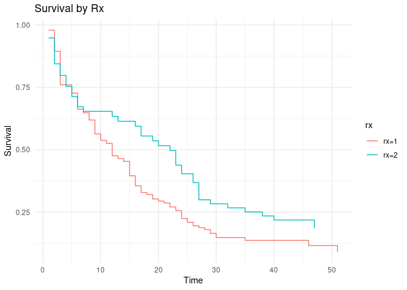
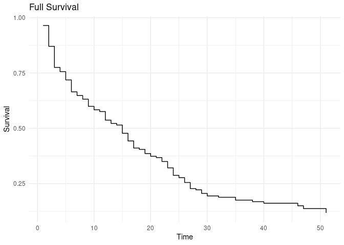

<!-- README.md is generated from README.Rmd. Please edit that file -->

# survhelp

<!-- badges: start -->
<!-- badges: end -->

The goal of survhelp is to create an way to easily extract survival data
out of survival objects

## Installation

You can install the development version of survhelp like so:

``` r
devtools::install_github("PaulGunsalus/survhelp")
```

## Example

``` r
library(survhelp)
library(survival)
## This example is taken from survival
bladder <- survival::bladder2

svd <- get_surv_data(coxph( Surv(start, stop, event) ~ strata(rx), data = bladder))
head(svd)
#>   time      surv    std.err     lower     upper n.risk n.event n.censor
#> 1    1 0.9789482 0.02082868 0.9389642 1.0000000     47       1        1
#> 2    2 0.8947410 0.04452604 0.8115924 0.9864082     46       4        0
#> 3    3 0.7600544 0.06026531 0.6506572 0.8878449     46       7        0
#> 4    5 0.7266468 0.06207361 0.6146243 0.8590868     45       2        1
#> 5    6 0.6627685 0.06431063 0.5479828 0.8015982     45       4        0
#> 6    7 0.6482027 0.06452562 0.5333074 0.7878510     45       1        1
#>      cumhaz   rx
#> 1 0.0212766 rx=1
#> 2 0.1112210 rx=1
#> 3 0.2743652 rx=1
#> 4 0.3193147 rx=1
#> 5 0.4113296 rx=1
#> 6 0.4335518 rx=1
tail(svd)
#>    time      surv    std.err     lower     upper n.risk n.event n.censor
#> 51   29 0.2833370 0.06217518 0.1842963 0.4356022     18       1        1
#> 52   32 0.2671508 0.06069304 0.1711493 0.4170018     17       1        0
#> 53   35 0.2509650 0.05913404 0.1581421 0.3982712     16       1        0
#> 54   38 0.2347795 0.05749192 0.1452851 0.3794016     15       1        2
#> 55   40 0.2185945 0.05575933 0.1325909 0.3603833     14       1        0
#> 56   47 0.1850362 0.05638117 0.1018340 0.3362178      6       1        7
#>      cumhaz   rx
#> 51 1.261118 rx=2
#> 52 1.319942 rx=2
#> 53 1.382442 rx=2
#> 54 1.449108 rx=2
#> 55 1.520537 rx=2
#> 56 1.687204 rx=2
```

Simple application building custom survival plots I would love add more
survival objects

``` r
library(ggplot2)
# svd <- get_surv_data(coxph( Surv(start, stop, event) ~ x, test2))
ggplot()+
  geom_step(aes(x = time, y = surv, color = rx), data = svd)+
  theme_minimal()+
  labs(x = "Time", y = "Survival", title = "Survival by Rx")
```



``` r

svd1 <- get_surv_data(survfit( Surv(start, stop, event) ~ 1, data = bladder))


ggplot()+
  geom_step(aes(x = time, y = surv), data = svd1)+
  theme_minimal()+
  labs(x = "Time", y = "Survival", title = "Full Survival")
```


